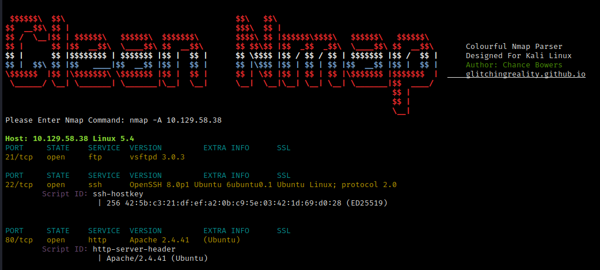
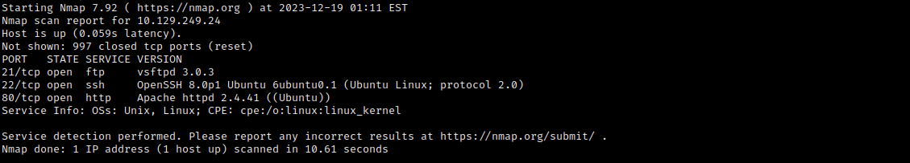

# Clean-Nmap, A Colourful Nmap Parser
A tool to enhance the efficiency of parsing through nmap scans via color coding; making it easier to identify important information.

### Basic Info
Tool used to simplify and colour code nmap output so that it is easier to read. When it is run, it will load the simplified nmap output in the current terminal window.

### Setup
To set up the tool simply clone it i.e. git clone. Navigate into that directory and then enter  pip install -r requirements.txt into the command line. This will install the required python modules if not already installed on your system.

### Launching The Program
To use the program simply open up a terminal navigate to the directory and run it with "python3 'nmap_parser.py'"

### Running The Program

Example of Simplified Colour Coded Output

Example of Original Output In Second Terminal

### Built With

* Python 3.11.6

### Authors

*** Chance Bowers --> glitchingrelaity.github.io ; Modernized the code in 2023 for Python 3 compatability & additional features.

***Zach Fleming --> zflemingg1@gmail.com ;  created the original python2 base script in 2018 which this is based off of.

